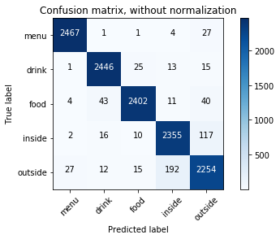

The capstone project is still in progress. 

Here is [the first version of slides](./Capstone_Project_slides.pdf).

[Presentation vedio](https://youtu.be/WMcGYdezf7E)

 

Built a Yelp photo classification model using convolutional neural network transfer learning based on VGG-16 model.

There are categories: menu, food, drink, inside, and outside.

This model beat Yelp's own classifier in precision by 1.5% (95.5% vs 94%), and in recall by 25.4% (95.4% vs 70%). 

More update is coming soon.

Confusion matrix 

